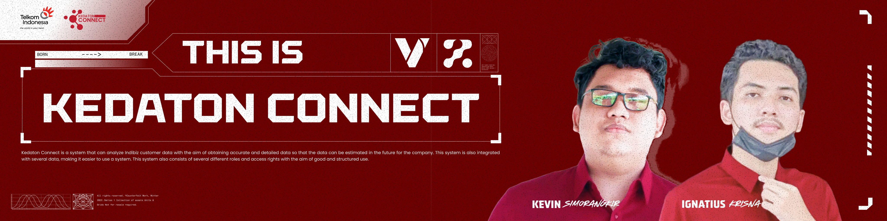

<div align="center">

<h1> Kedaton Connect | <b>Created by : Duo K</b></h1>
<h2> Version : 1.0 </h2>

[](#)
[](#)
[](#)
</div>

## **Table Of Contents**

[Contributing](#member-of-duo-K)

[Introduction System](#introduction-system)

[Member Of Duo K](#member-of-duo-K)

[Role & Position Member Of Duo K](#role--position-member-of-chuakz-team)

[Installation Steps](#instalation-steps)

[UML Diagram](#uml-diagram)

[Screenshot System](#screenshots)

[Video Demo System](#video-demo-game-lost)

## **Introduction System**

Kedaton Connect is a system that can analyze Indibiz customer data with the aim of obtaining accurate and detailed data so that the data can be estimated in the future for the company. This system is also integrated with several data, making it easier to use a system. This system also consists of several different roles and access rights with the aim of good and structured use.

## **Member Of Duo K**

|  [<br /><sub><b>Kevin Simorangkir</b></sub>](https://github.com/kevinsimorangkir21)<br /> 121140150 <br /> | [<br /><sub><b>Ignatius Krisna</b></sub>](https://github.com/inExcelsis1710)<br />121140037 <br /> | 
|--|--|

## **Role & Position Member Of Duo K**

<div align="center">

| Name | Division
| :---: | :---: |
| Kevin Simorangkir     | BGES |
| Ignatius Krisna       | MBB |

</div>

## **Instalation Steps**

There are 2 different installation stages, namely <b> Pre Install</b> and <b> Intra Install </b>.

### **Pre-Install**

At this stage is the stage of preparing several tools, especially frameworks and tools that will later be needed for this project. The following is needed for this project:

<li> Composer :</li>

```bash
https://getcomposer.org/download/
```

<li> Laravel 5 :</li>

```bash
https://laravel.com/docs/10.x
```

<li> XAMPP :</li>

```bash
https://www.apachefriends.org/download.html
```

<li> Git Bash :</li>

```bash
https://git-scm.com/downloads
```

### **Intra-Install**

At this stage is the installation stage of this project with the available steps. Here are the installation steps:

<li> Run GitBash and <i>clone</i> this GitHub repository</li>

```bash
https://github.com/kevinsimorangkir21/TelkomAkses-Dash.git
```

<li> Open Visual Studio Code / Other Code Editors </li>

<li> Run Command Prompt / Terminal similar </li>

```bash
composer update
```

<li> Run XAMPP, create a database. Can be accessed at the following link </li>

```bash
http://localhost/phpmyadmin
```

<li> Copy .env.example / run CLI with command</li>

```bash
cp .env.example .env
```

<li> Change the file name .env.example to .env</li>

```bash
http://localhost/phpmyadmin
```

<li> Access the .env file again and change DB_DATABASE to the name of the database that was created on LocalHost </li>

<li> Run Command Prompt/Terminal again and enter</li>

```bash
php artisan migrate:fresh --seed
```

```bash
php artisan vendor:publish
```

```bash
php artisan key:generate
```

<li> To access this project on the web, run the command</li>

```bash
php artisan serve
```

## **UML Diagram**

### The following is a UML diagram in the Kedaton Connect system which has been arranged in a perfect structure according to the storyline


## **Screenshots**

### The following is a display of the Kedaton Connect system which has been arranged with a perfect structure according to the storyline


## **Video Demo System**

[](#)
